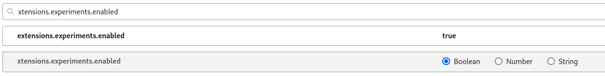

# F_Extensions


Study how Firefox extraction works, how to make your own, how to activate it, and how to create your own script to control a webpage.
Extracted: What kind of data do you need?
Download: Based on file extension.


#ss


```
about:config
```



```
Enabled
```


```
about:debugging#/runtime/this-firefox
```


```
Out
```


Run the changed extension sources
Via about:debugging

If you want to debug this extension on recent Desktop versions, you can use about:debugging:

   1. Open about:config in Firefox
   2. Set extensions.experiments.enabled pref to true
   3. Open about:debugging
   4. Click the Load Temporary Add-on... button
   5. Select ./src/manifest.json and hit open.
   6. Test!


# Todo


git tag -a v0.0.2 -m "Release version 0.0.2"
git push --tags


# notes

```

https://github.com/learn-anything/firefox-extensions

https://extensionworkshop.com/documentation/develop/extensions-and-the-add-on-id/


https://github.com/mdn/webextensions-examples

https://github.com/mozilla-extensions/webcompat-addon

```
